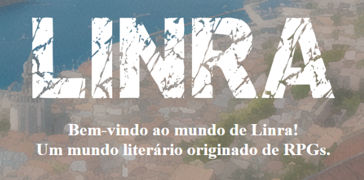

<h1 align="center"> Os Contos de Linra </h1>

Projeto de aprendizado e implementação web para site de livro.

  <a href="#-tecnologias">Tecnologias</a>&nbsp;&nbsp;&nbsp;|&nbsp;&nbsp;&nbsp;
  <a href="#-projeto">Projeto</a>&nbsp;&nbsp;&nbsp;|&nbsp;&nbsp;&nbsp; 
  <a href="#memo-licença">Licença</a>

 

  

## 🚀 Tecnologias

Esse projeto foi desenvolvido com as seguintes tecnologias:

- HTML e CSS
- Git e Github

## 💻 Projeto

Aprendendo e desenvolvendo CSS e HTML antes de ir para outras técnologias.

## Licença

Esse projeto está sob a licença MIT.

---

Feito por <b>Cassio Amorim Fernandes</b>.